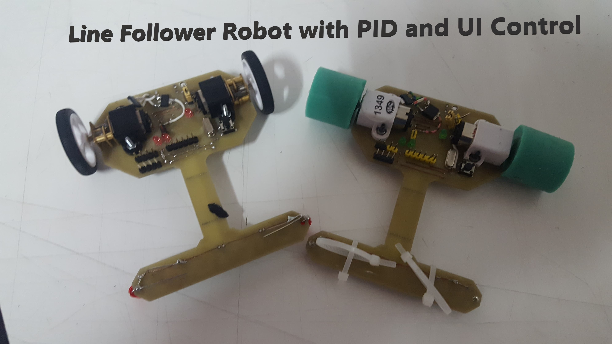

# Line Follower Robot – Robochallenge 2018🏎️

University Project | International Robotics Contest

📘 Overview

This project was developed as part of a university team participating in the Robochallenge International Robotics Contest (2018) under the Line Follower category. The objective was to build a high-performance robot capable of accurately following an electrical-tape track on a white surface while maintaining controlled acceleration to avoid oscillation and ensure stable navigation.

🎯 Project Goals

• Achieve fast and stable line tracking

• Prevent over-acceleration and oscillation

• Ensure consistent performance on various track layouts

• Provide real-time tuning capabilities for PID parameters

🛠️ Technical Highlights
Embedded Control

• Implemented PID control for precise motor response

• Worked with STM microcontrollers for real-time sensor processing

• Integrated IR sensors and motor drivers for accurate line detection

• Software & Interface

• Developed a C# desktop UI for real-time tuning

• Bluetooth communication for live transmission of PID parameters

• Telemetry visualization for easier debugging and optimization

• Engineering Focus

• Embedded electronics and signal handling

• PID tuning for speed vs. stability

• Wireless communication and interface design

👥 Team

Worked in a two-person team, focusing on control algorithms, electronics, and communication interface.

Gained experience in collaborative problem-solving under contest constraints.

🚀 Skills Gained

• STM32 microcontroller development

• PID control and tuning

• Electronics and sensor integration

• C# application development

• Bluetooth communication

• Competitive robotics experience

📸 Images

## Video Presentation

https://github.com/user-attachments/assets/58370985-117f-48c2-960f-9493781b345f

https://github.com/user-attachments/assets/3563ba95-f6c6-4a71-bbea-5880b89e6af1

https://github.com/user-attachments/assets/2ad60a8a-7bea-4f4c-bc0b-793d28e9c65f

